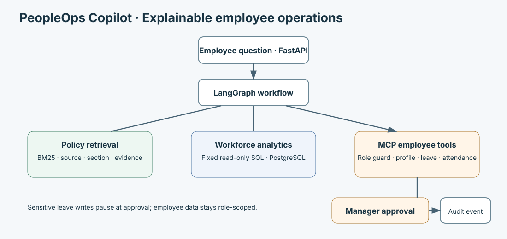

# PeopleOps Copilot

**Explainable employee operations agent for safe HR analytics, policy retrieval, and approval-gated actions.**

An employee question moves through a guarded workflow and returns a source, SQL, or action receipt where relevant.

```text
Employee question
       ↓
Agent routing
   ↙     ↓      ↘
 RAG    SQL     MCP
   ↘     ↓      ↙
 Authorization
       ↓
Approval when needed
       ↓
Audited result
```



## What is PeopleOps Copilot?

PeopleOps Copilot is an internal operations assistant built on the repository's existing LangGraph SQL-agent architecture. It adds a synthetic employee domain, policy retrieval, MCP employee operations, role checks at the service boundary, explainability metadata, and a leave-request approval path.

## Problem

Employees and managers need answers from policy documents and workforce data without exposing records broadly or allowing an assistant to make unreviewed changes.

## Key capabilities

- BM25 retrieval over synthetic HR policies with source, section, and evidence sufficiency.
- Read-only department headcount analytics with SQL and table/filter metadata.
- Employee profile, leave-balance, team-headcount, and attendance operations exposed as MCP tools.
- Role-aware access for employee, manager, HR, and admin principals.
- Leave-request proposals that validate dates and balances, pause for manager approval, then create a request and audit event.
- Existing durable job, SQL validation, bounded-repair, and LangGraph checkpoint infrastructure remains available for registered SQL tasks.

## Architecture and agent workflow

```text
FastAPI → durable job worker → LangGraph SQL workflow → SQL validation → database
    ├── policy question → scoped BM25 retrieval → cited evidence
    ├── workforce analytics → read-only query → bounded result and explanation
    └── employee action → MCP tool → authorization and validation
                                  → approval proposal → transaction → audit event
```

The Planner proposes work. Deterministic validation, authorization, and approval gates decide what can execute. No hidden reasoning is returned.

## MCP tools

`get_employee_profile`, `get_leave_balance`, `get_team_headcount`, `get_attendance_summary`, `create_leave_request`, and `ask_hr_policy` are exposed by the stdio MCP server. They call actual service/database operations through FastAPI and apply authorization again inside the data service. MCP clients cannot approve their own proposals.

## Data model

The synthetic schema contains `employees`, `departments`, `leave_balances`, `leave_requests`, `attendance_daily`, and `audit_events`, plus an internal action-proposal table. The local seed is 120 synthetic employees across six departments, six months of weekday attendance, and sample requests. Names and addresses use generated values and `.example.test` addresses.

PostgreSQL is the employee and persistent job/checkpoint database in Compose. Local setup uses SQLite by default for a zero-setup run; set `PEOPLEOPS_DATABASE_URL` to use PostgreSQL locally.

## Security and authorization

- Employees can read their own profile, balance, and attendance.
- Managers can read direct reports and department aggregates; only the direct manager may approve a report's leave proposal.
- HR and admin can read organization-wide employee data and aggregate analytics.
- Role checks occur in the API and the PeopleOps service. The principal name must match an employee code for employee/manager scoped access.
- Analytics return bounded aggregates and use fixed read-only SQL. User SQL is not interpolated into this headcount operation.
- Audit events store a hash of input metadata rather than credentials.

## Human approval flow

`POST /agent/actions/leave-requests` verifies the employee, dates, leave type, available balance, and manager assignment, then stores a pending preview. A manager reviews it at `POST /approvals/{approval_id}/review`. Approval writes the leave request, updates the balance, and records an audit event in one database transaction. Rejection records the decision without creating a request.

## RAG

The synthetic corpus in `data/peopleops/policies.json` contains eight policy documents (nine section passages), with policy IDs, titles, sections, text, and effective date. Retrieval reuses the existing bounded BM25 retriever. No confidence percentage is shown; `evidence_sufficient` reflects whether a passage matched.

## NL-to-SQL

The existing architecture retains its LangGraph planner, statement validator, allowlisted database policies, execution limits, bounded recovery, verifier, and durable worker. PeopleOps headcount currently uses a fixed parameterized aggregate query and returns the SQL, referenced tables, filters, validation status, and result summary. General free-form natural-language HR-to-SQL task registration is not yet connected to the synthetic employee store.

## Evaluation

`data/peopleops/evaluation.json` contains 33 HR-oriented cases across policy, analytics, follow-up, authorization, ambiguity, approvals, and adversarial inputs. The deterministic local evaluator exercised 29 cases: 29 passed, 0 failed, and 4 were not exercised (two ambiguous requests and two unsupported write types). These are fixed service-path checks, not model-quality or latency metrics.

## Local setup

```powershell
py -m venv .venv
.\.venv\Scripts\Activate.ps1
pip install -e '.[api,dev]'
$env:SQL_AGENT_API_KEYS='{"hr-local":{"name":"hr","role":"hr"},"manager-e001":{"name":"E001","role":"manager"},"employee-e002":{"name":"E002","role":"employee"}}'
uvicorn sql_agent.api:create_app --factory --reload
```

The PeopleOps SQLite database is created at `runtime/peopleops.sqlite` on first service startup and seeded deterministically apart from current-date fields. Configure `PEOPLEOPS_DATABASE` to choose another local SQLite file, or set `PEOPLEOPS_DATABASE_URL` for PostgreSQL.

## Docker setup

```sh
docker compose up --build
```

Compose runs the API, worker, and PostgreSQL employee/job store. Local demonstration credentials are configured in `compose.yaml`; replace them before using a shared environment.

## API

- `GET /health`
- `POST /agent/query/policy`
- `POST /agent/query/headcount`
- `GET /employees/{employee_code}`
- `GET /employees/{employee_code}/leave-balance`
- `GET /employees/{employee_code}/attendance`
- `POST /agent/actions/leave-requests`
- `GET /approvals/pending`
- `POST /approvals/{approval_id}/review`
- `GET /audit/events` (HR/admin only)
- Existing SQL job, trace, and review APIs remain available under `/v1`.

Send `x-api-key` with a configured principal. Policy question example:

```json
{"question":"What is the annual leave policy?"}
```

Headcount example:

```json
{"department":"Engineering"}
```

## Example queries

- “What is the reimbursement limit?”
- “How many employees are in Engineering?”
- “Check E002's leave balance.” (use principal `E002`)
- “Create an annual leave request for E002 from 2026-12-10 to 2026-12-12.”

## Project structure

- `src/sql_agent/peopleops.py` — employee data, authorization, policy retrieval, and approval operations.
- `src/sql_agent/api.py` — FastAPI application and PeopleOps routes.
- `src/sql_agent/mcp_server.py` — stdio MCP boundary.
- `src/sql_agent/database_workflow.py` — LangGraph SQL/approval checkpoint workflow.
- `src/sql_agent/sql_validation.py` — SQL classification and read-only validation primitives.
- `data/peopleops/` — synthetic policies and evaluation cases.
- `tests/` — existing SQL architecture tests and PeopleOps tests.

## Known limitations

- Local development defaults to SQLite; Compose uses PostgreSQL for both HR data and durable jobs.
- HR analytics provide a fixed parameterized headcount query, not general NL-to-SQL over employee tables.
- Leave approval is atomic within the PeopleOps database but is not yet resumed through the existing LangGraph checkpoint store.
- The evaluation file has expected cases but no scored benchmark run.
- Seeded employees and policy text are synthetic examples, not legal or company policy.

## Project foundation

This derivative is based on the open-source [SQL-Agent architecture](https://github.com/jianghongcheng/SQL-Agent). PeopleOps Copilot adds an employee operations domain, synthetic data and policies, authorization boundaries, MCP operations, and approval-gated leave requests. Historical upstream evaluation artifacts remain attributable to their original project and are not presented as PeopleOps results.

## License

See [LICENSE](LICENSE). Existing license and attribution notices are retained.
